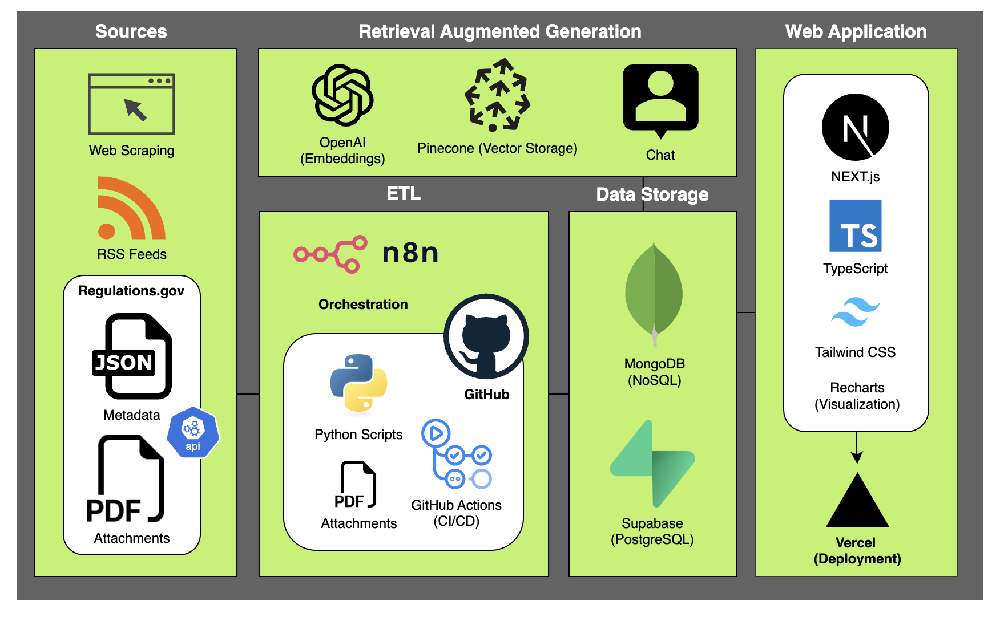
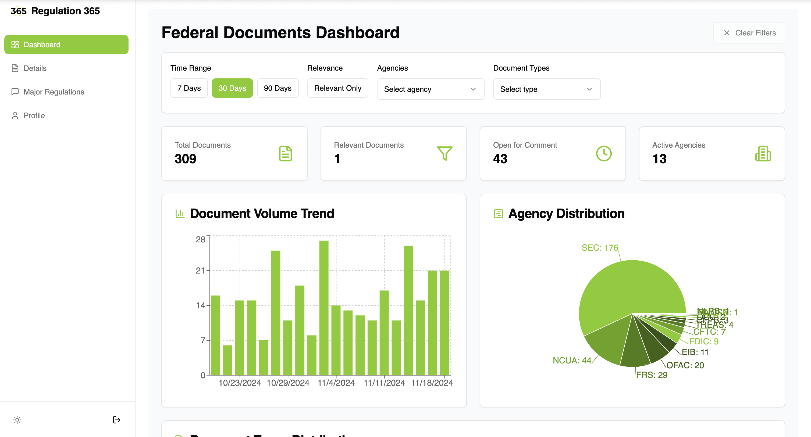
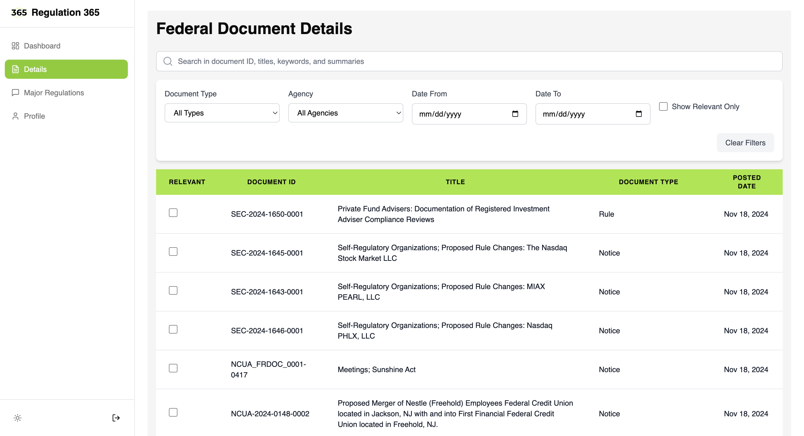
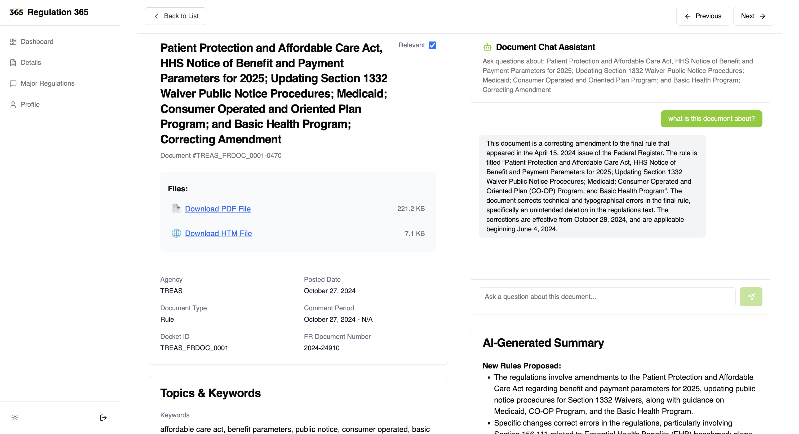

# Regulation 365 - Financial Regulation Management Platform

## Overview

Regulation 365 is a comprehensive web platform designed to help financial institutions navigate and manage regulatory requirements. The platform provides real-time updates on financial regulations, enforcement actions, and regulatory changes across multiple US federal agencies.

### Video

https://github.com/user-attachments/assets/bf66d925-36ea-4e27-a91a-d9aa86f3f704

### Slides

[View Presentation](https://www.beautiful.ai/player/-OCUzcy0fURUq_f5AJnk)

### Data Collection Github

[Data Collection Repository](https://github.com/priscillaoclark/reg-extract)

### Tech Stack



### Dashboard



### Document Listing and Search



### Document Detail and Chat



## Key Features

### 1. Document Management

- Real-time tracking of federal regulatory documents
- AI-powered document summarization
- Smart document categorization and filtering
- Relevance marking and organization

### 2. Interactive Chat Systems

- Document-specific chat interface for detailed queries
- Regulatory knowledge base chat for general regulatory questions
- AI-powered responses backed by regulatory documents
- Context-aware conversations with document references

### 3. Enforcement Action Tracking

- Real-time monitoring of enforcement actions from:
  - Consumer Financial Protection Bureau (CFPB)
  - Federal Deposit Insurance Corporation (FDIC)
  - Federal Reserve Board (FRB)
  - Office of the Comptroller of the Currency (OCC)
  - Financial Crimes Enforcement Network (FinCEN)
  - Office of Foreign Assets Control (OFAC)
  - Securities and Exchange Commission (SEC)
- Detailed analytics and trend analysis
- Customizable dashboard with key metrics

### 4. News Aggregation

- Real-time regulatory news from multiple sources
- Curated content from legal and professional services firms
- RSS feed integration with major regulatory bodies
- Categorized news display with source verification

## Technology Stack

- **Frontend:**

  - Next.js 14 (App Router)
  - React
  - TypeScript
  - Tailwind CSS
  - shadcn/ui components
  - Recharts for data visualization

- **Backend:**

  - Supabase (Database & Authentication)
  - OpenAI API
  - Pinecone (Vector Database)
  - Vercel (Deployment)

- **APIs & Integration:**
  - Ghost CMS for blog content
  - RSS Feed parsing
  - Multiple regulatory agency APIs

## Getting Started

### Prerequisites

- Node.js 18+
- npm or yarn
- Supabase account
- OpenAI API key
- Pinecone account
- Ghost CMS account (for blog functionality)

### Environment Variables

Create a `.env.local` file in the root directory with the following variables:

```env
# Supabase Configuration
NEXT_PUBLIC_SUPABASE_URL=your_supabase_url
NEXT_PUBLIC_SUPABASE_ANON_KEY=your_supabase_anon_key
SUPABASE_SERVICE_ROLE_KEY=your_service_role_key

# OpenAI Configuration
OPENAI_API_KEY=your_openai_api_key

# Pinecone Configuration
PINECONE_API_KEY=your_pinecone_api_key
PINECONE_INDEX_NAME=your_index_name

# Ghost CMS Configuration
GHOST_API_URL=your_ghost_url
GHOST_CONTENT_API_KEY=your_ghost_api_key
```

### Installation

1. Clone the repository:

```bash
git clone https://github.com/your-username/regulation-365.git
cd regulation-365
```

2. Install dependencies:

```bash
npm install
```

3. Run the development server:

```bash
npm run dev
```

4. Open [http://localhost:3000](http://localhost:3000) in your browser

### Database Setup

The application requires specific Supabase tables and schemas. Here are the main tables needed:

- `federal_documents`: Stores regulatory documents
- `chat_logs`: Stores chat interactions
- `ea_cfpb`: CFPB enforcement actions
- `ea_fdic`: FDIC enforcement actions
- `ea_frb`: Federal Reserve enforcement actions
- `ea_occ`: OCC enforcement actions

Detailed schema information is available in the database setup documentation.

## Project Structure

```
regulation-365/
├── app/                    # Next.js app directory
│   ├── (admin)/           # Admin routes
│   ├── (home)/            # Public routes
│   ├── api/               # API routes
│   └── auth/              # Authentication routes
├── components/            # React components
│   ├── ea/                # Enforcement action components
│   ├── ui/                # UI components
│   └── ...
├── lib/                   # Utility libraries
├── public/               # Static files
├── types/                # TypeScript type definitions
└── utils/                # Utility functions
```
